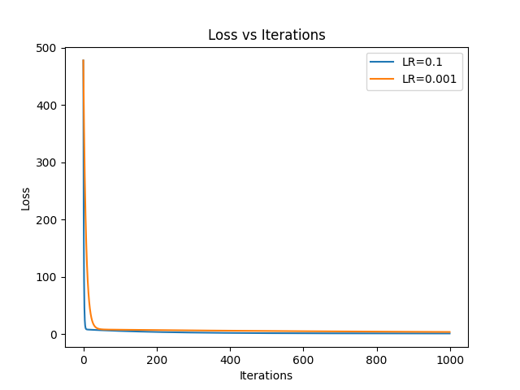
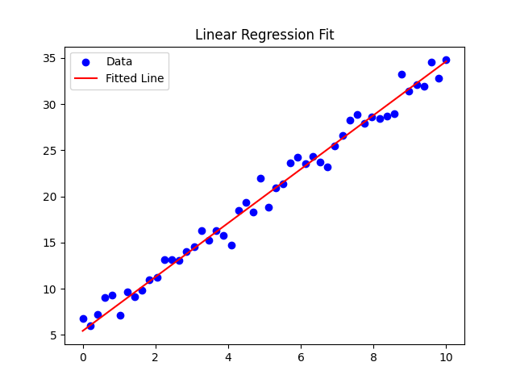

# Linear Regression from Scratch

## Overview
This project implements linear regression using three approaches:
- Direct (analytical) method  
- Matrix method (Normal Equation)  
- Gradient Descent (iterative optimization)  

The goal was to understand the mathematical foundations and optimization behavior of linear regression without relying on machine learning libraries.

---

## Methods Implemented

### 1. Direct Formula
Closed-form solution using summations.

### 2. Matrix Method
Uses the Normal Equation:
\[
\beta = (X^T X)^{-1} X^T y
\]

### 3. Gradient Descent
Iteratively updates parameters to minimize Mean Squared Error (MSE).

---

## Results

### Loss Curve


### Regression Fit


---

## Key Insights
- Gradient descent converges to the analytical solution when learning rate is properly tuned  
- High learning rates cause instability (NaN values)  
- Matrix method gives exact solution but is not scalable  

---

## Tech Stack
- Python  
- NumPy  
- Matplotlib  

---

## How to Run

```bash
pip install numpy matplotlib
python -m src.main
